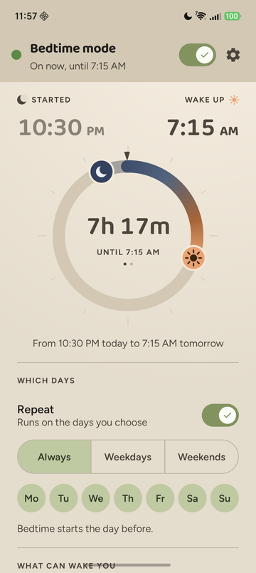
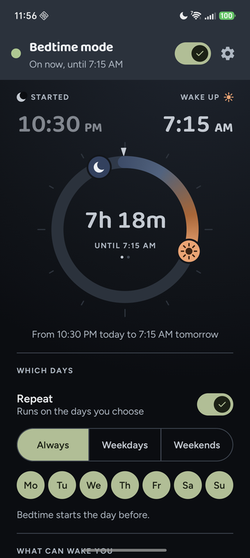
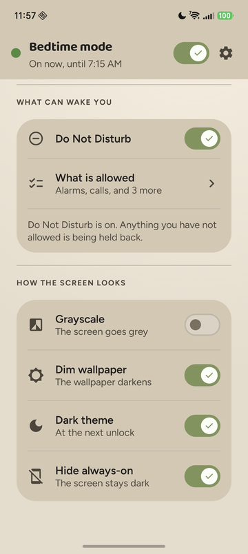
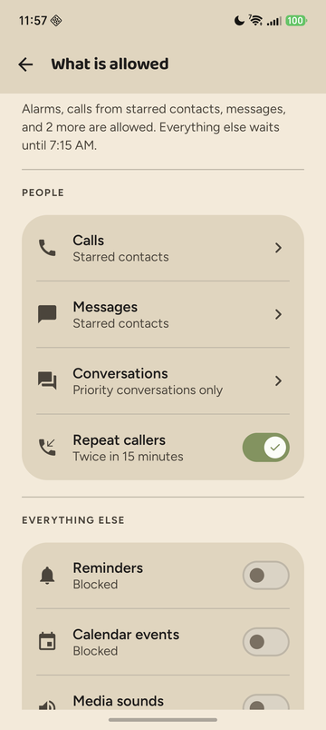
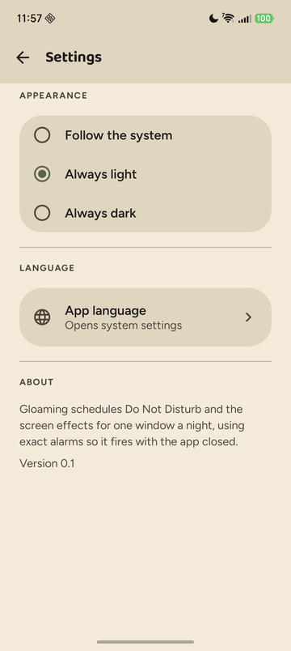

<div align="center">


# Gloaming

**A bedtime app for Android that keeps its own schedule.**

One sleep window a night — Do Not Disturb and the screen effects that go with
it — driven by exact alarms, so it fires with the app closed.

[](LICENSE)
[-3DDC84)](#requirements)
[](https://kotlinlang.org)
[](https://developer.android.com/jetpack/compose)
[](#tests)







</div>

## Why it exists

Android's own bedtime mode is scheduled as a **WorkManager job**, and jobs are
advisory. The system decides when they run, and every vendor's battery
management gets a say on top of that. When something in that chain defers a job
indefinitely, bedtime silently never happens — there is no error, no
notification, nothing to notice except that the screen stayed colourful.

Exact alarms are the other path. They are a separate, user-granted permission
with a scheduling guarantee, and they do not go through JobScheduler at all.
Gloaming owns its trigger that way: it holds an `AutomaticZenRule` for the
policy and flips that rule from its own alarms.

**The case that prompted it.** On an Honor Magic 8 Pro (BKQ-N49, MagicOS
10.0.0.199, Android 16), Digital Wellbeing's bedtime job carries an undocumented
constraint that is never satisfied:

    Required:    HN_USER_EXPERIENCE [0x200400]
    Unsatisfied: HN_USER_EXPERIENCE [0x400]

The job never runs, so bedtime only ever happens while Wellbeing is in the
foreground, and the constraint cannot be satisfied or removed even over adb.
`setExactAndAllowWhileIdle` is not gated by it: measured firing 149 ms after the
scheduled instant with the app swiped from recents and the screen off, on the
ordinary user path — no battery whitelist, standby bucket 10.

That is one vendor on one build, and it is where the app came from rather than
what it is for. Background work being quietly dropped is a common shape across
Android OEMs; the alarm-driven approach here does not depend on which vendor is
doing it, or on any vendor doing it at all.

## What it does

- **A 24-hour dial.** One window, dragged at either end. It is a full day rather
  than a clock face because a 12-hour face cannot draw a window longer than
  twelve hours; Apple's Sleep ring makes the same choice. Days are chosen as the
  **mornings** you want the window to end on, so asking for the weekend means
  Saturday and Sunday, not Friday night.
- **Do Not Disturb**, with a per-night allowlist — who can call, who can
  message, conversations, repeat callers, reminders, calendar events, media. The
  screen reports what the system says is actually in effect, rather than what the
  app believes it asked for. Alarms are always allowed, and the app says that is
  its own choice rather than pretending the platform forbids silencing them.
- **Screen effects**, as far as your phone honours them: greyscale, wallpaper
  dimming, dark theme, always-on display. All four are standard
  `ZenDeviceEffects`, and a device will happily accept an effect it has no
  intention of applying — so which ones take effect varies. Where an effect does
  nothing and nothing else can reach it, the control is not drawn at all rather
  than offering a switch that lies.
- **A boot watch.** Some vendors withhold `BOOT_COMPLETED` from apps their
  launch manager has decided are unimportant, which leaves a bedtime app armed
  with no alarms behind it. Gloaming compares the boot it handled against the
  boot it is running on, says so when one goes unreported, and offers a button
  to the screen that fixes it.
- **English, Russian and Ukrainian**, with a per-app language picker, and clock
  times in whichever 12- or 24-hour format the phone is set to.
- **A journal.** The app keeps its own on-device log of every decision it makes
  overnight. Useful anywhere, and necessary on devices that encrypt logcat for
  third-party apps.

## Devices

Nothing vendor-specific runs unconditionally, and no device is special-cased
into working:

- Capability is **measured at runtime, not looked up in a device list**. Whether
  always-on display can be suppressed is settled by reading the AOSP key the
  effect acts on; where that key is present, the switch is simply live.
- The single `Build.MANUFACTURER` test in the codebase returns Honor and
  Huawei's own always-on keys and null everywhere else, and every caller stops
  at null — so on any other phone that object does nothing at all.
- The one device list is an **exclusion** list, consulted only when the AOSP key
  it would otherwise read is absent — so an unrecognised phone is treated as
  capable rather than as broken.
- There is exactly one write to `Settings.System`, `Secure` or `Global` in the
  whole app, it is the always-on route below, and it cannot happen by accident:
  it needs a permission Android grants only over adb, so on an ordinary install
  the code is inert and the control is not drawn.

Run on two phones so far: the Honor above, and a OnePlus CPH2653 on LineageOS
23.2 (Android 16). The second one installed and ran first time, in Ukrainian on
a 12-hour clock, with no device-specific work.

The two disagree about always-on display — the platform's request is honoured on
the OnePlus and ignored by the Honor — and the app works that out by itself,
showing a live switch on one and, on the other, nothing at all unless you take
the optional route below. They agree that dark theme works, applied when the
screen next turns off. Reports from other hardware are welcome.

## Requirements

Android 15 (API 35) or newer — `ZenDeviceEffects` and `AutomaticZenRule.Builder`
are API 35, and the app is built entirely around them.

Two permissions, both user-granted from inside the app: notification policy
access (Do Not Disturb) and exact alarms.

### Honor, Huawei and other phones with an "app launch" manager

Some vendors withhold `BOOT_COMPLETED` from apps their launch manager has
decided are unimportant. Measured on an Honor Magic8 Pro: with Gloaming set to
"Manage automatically", the app was never told the phone had restarted, so it sat
armed with no alarms behind it until it was next opened — silently, all night.

Fix it once, in **Settings ▸ Apps ▸ App launch ▸ Gloaming ▸ Manage manually**,
with auto-launch on. Battery optimisation is a different setting and does not
help; it was tested both ways.

Gloaming notices this by itself and offers a button straight to the right
screen. The notice clears once a boot arrives normally, and it never asks which
phone you have, so it works on any vendor doing this.

### Optional: always-on display on Honor and Huawei

Some phones ship their own always-on display and ignore the platform's request
to suppress it — measured on an Honor Magic8 Pro, where even the system's own
lever is disregarded. On those phones the always-on row is not shown, because
nothing the app can reach would move it.

There is one route, and it needs a permission Android will not grant to an
ordinary app. If you want it, connect the phone and run:

```bash
adb shell pm grant com.jemcik.gloaming android.permission.WRITE_SECURE_SETTINGS
```

The row then appears and bedtime switches the display off, restoring whatever
you had when the window ends. The app records your previous values before it
writes anything and restores them on END, on boot, and after a crash. Revoking
the permission, or never granting it, leaves the whole path inert.

Note the app cannot undo this if you uninstall it mid-window; switch bedtime off
first, or turn always-on back on in Settings.

## Build

    ./tools/build.sh      debug APK, full log at /tmp/build.log
    ./tools/deploy.sh     install on the attached device
    ./tools/check.sh      what the phone thinks: zen state, the rule, the app's
                          own view, the next alarms and the journal. Read-only.

## Tests

    ./gradlew test        80 tests, JVM only, about a second
    ./gradlew coverage    JaCoCo HTML at app/build/reports/jacoco/coverage

They cover the scheduling core (pure functions of times, days and an injected
`now`), the sentence assembly in all three languages, the screen interactions,
the boot detection, and the one-shot preferences migration — the only code here
that could corrupt data without saying anything. Some of them measure real text
layout at each locale's own widths, because a row that fits in English and wraps
in Ukrainian is a bug you cannot see from the source.

What they cannot cover is everything that depends on the device: whether an
exact alarm fires with the screen off, whether greyscale is really applied,
whether `updateAutomaticZenRule` clears a rule's condition. That is what the
journal and `tools/check.sh` are for.

A pre-push hook runs the tests, lint and the translation checkers. Opt in once
per clone:

    git config core.hooksPath tools/hooks

## Translation

    python3 tools/translate.py ru          # or uk
    python3 tools/check_translation.py app/src/main/res/values-ru/strings.xml ru

Gemini Pro translates, two models side by side; the checker verifies what a
human will not spot by eye — dropped format placeholders, missing plural forms
(Russian and Ukrainian need four where English needs two), keys that vanished,
strings left in English, and rows that grew past the width they have to fit.

Needs `GEMINI_API_KEY` in `.env.local`, which is git-ignored.

## Licence

Apache License 2.0 — see [LICENSE](LICENSE).

The repository also redistributes two SIL Open Font License fonts and a set of
Material Design icon paths; [NOTICE.md](NOTICE.md) lists them with their
licences.

## CLAUDE.md

The real documentation. It carries what the code cannot: the behaviour measured
on hardware, the design decisions and what was rejected, and the mistakes worth
not repeating — among them that `updateAutomaticZenRule` silently clears a
rule's condition, so rewriting a live rule switches Do Not Disturb off
underneath you. Much of it is written against one phone, because that is the
phone it could be measured on.
